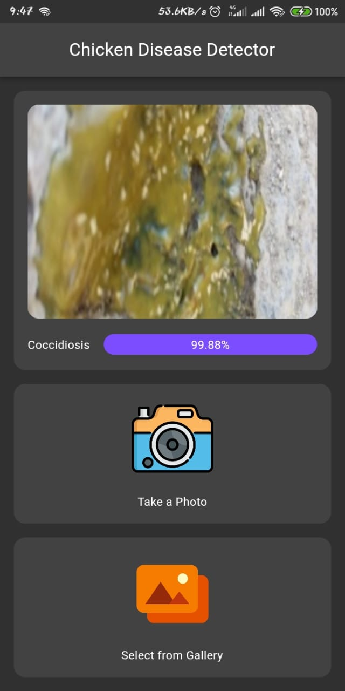

# Chicken Disease Detector

Chicken Disease detection with Flutter and TFLite. Chicken Disease Detector makes it possible to identify Chicken Diseases in 4 different categories, including Coccidiosis, Healthy, New Castle Disease, and Salmonella.

## Data set

- [Kaggle](https://www.kaggle.com/datasets/allandclive/chicken-disease-1)

## Preview

<p align='center'>
    
    
</p>

##### This project contains generated files. Don't forget to run scripts below before running the project.

```sh
sh scripts/build_runner.sh
sh scripts/flutter_gen.sh
```
